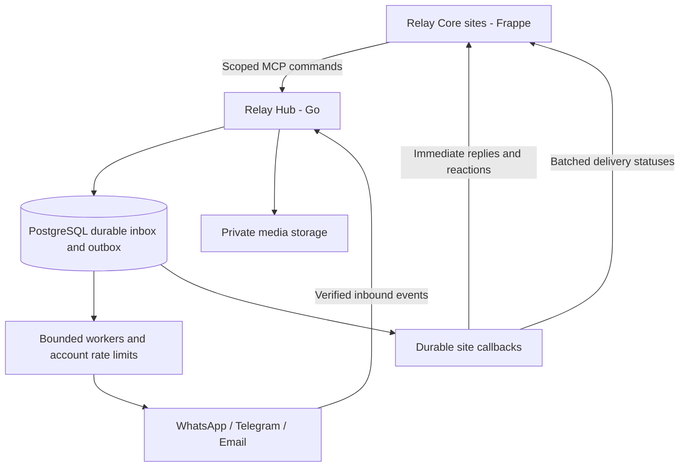

# Proposed architecture

## Ownership

Each Hub account maps to exactly one Core site and enables selected channel connections. Every tenant-owned row and reference is account-scoped. Core owns business permissions and AI; Hub owns provider transport and credential isolation. The Hub administration UI will use Frappe-style frontend components without requiring Frappe as its runtime.

## Durability

Commit incoming submissions and callback events before acknowledging acceptance. Use stable caller message IDs and provider event IDs for deduplication. Claim queued work with short PostgreSQL transactions, leases and fencing tokens; release database locks before network calls.

Delivery is not assumed exactly once. A timeout after provider submission can be indeterminate; do not blindly resend when provider idempotency or reconciliation cannot establish the outcome.

## Throughput

Core submits bounded chunks, initially 50 messages. Separate interactive work from campaigns; use per-account quotas, provider-aware rate limits, retry backoff and bounded callback concurrency. Batch statuses by count or short timer while preserving a priority lane for inbound replies, reactions and call events. One offline site must not block other accounts.

## Interfaces

Use versioned typed MCP commands for submissions, batch status, templates, channel configuration and call operations. Provider webhooks and Core callbacks use authenticated HTTP. Share authorization and application services across transport handlers. Never return stored credentials from tools.

Event envelopes carry schema version, event ID, account/channel connection, entity ID, event kind, occurred/ingested times and correlation ID. Core acknowledges only after durable deduplication and projection updates. Preserve raw provider events alongside normalized states.

## Channels and media

WhatsApp template/provider states remain authoritative; combine webhook updates with hourly reconciliation. Telegram preserves originating bot, chat and topic identifiers. Email preserves MIME and reply-thread headers and prevents automated forwarding/reply loops.

Calls and recording are capability-gated pending provider verification. Recording needs bounded uploads, durable segments and explicit completion states. Media stays private and outside relational rows; shared durable storage is needed before horizontally scaling media workers.

## Milestones

1. Account-scoped persistence and typed command/event contracts.
2. Durable queues, callback recovery and fake-provider crash tests.
3. WhatsApp and Telegram adapters, followed by email send/receive.
4. Template reconciliation and operational administration UI.
5. Calls and recordings after capability verification.
6. Load testing, migration dry runs and a separately reviewed cutover.

Acceptance includes tenant isolation, replay safety, bounded memory, restart recovery, non-regressing delivery projections and priority replies during bulk load. These are planned release gates, not claims of completed functionality.
